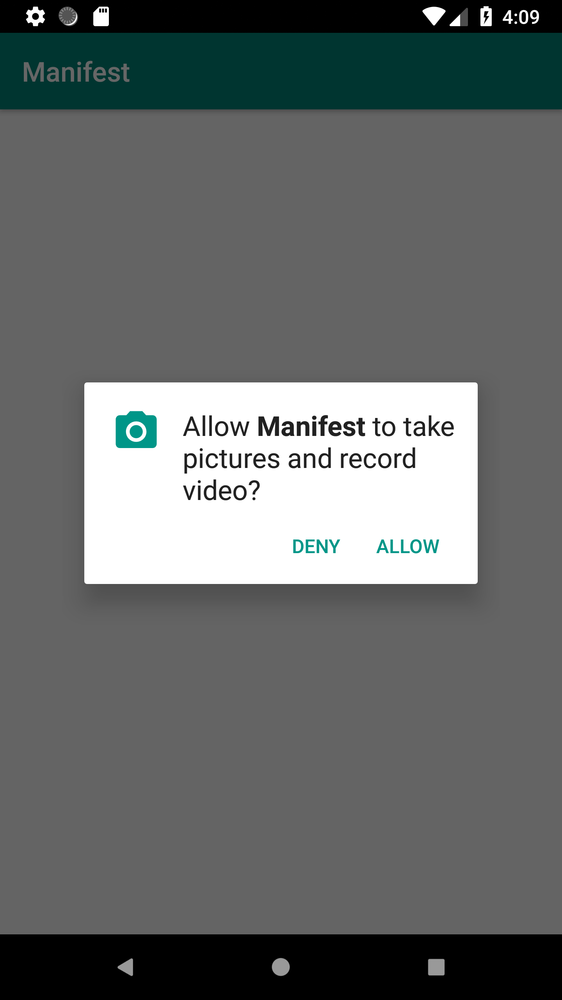

# Content

[1 - Description](#description)

[2 - IDE](#ide)

[3 - Objective](#objective)

[4 - Composition](#composition)

[5 - Run](#run)

[6 - Requirements](#requirements)

[7 - Usage](#usage)

[8 - Gradle](#gradle)

[9 - Contact](#contact)

[10 - Prints](#prints)

# Description

-   Permission - Architecture SDK.

# IDE

- Android Studio 3.1.1
- Build #AI-173.4697961, built on April 3, 2018
- JRE: 1.8.0_152-release-1024-b01 x86_64
- JVM: OpenJDK 64-Bit Server VM by JetBrains s.r.o
- Mac OS X 10.14.1

# Objective

  - This is a backup code of my local Permission SDK
  - Responsible for abstracting Android permissions requests

# Overview

  - N/A

# Composition

  - Android.Support:appcompat-v7:28.0.0
  - Android.Support:support-annotations:28.0.0

# Run

  - Clone this repository and open build.gradle with Android Studio

# Requirements

  - minSdkVersion 19
  - targetSdkVersion 28
  - compileSdkVersion 28
  - buildToolsVersion 28.0.3

# Usage

#### 1. Choose available permission (i.e. CAMERA)

      Permission.CAMERA

#### 2. Build device model

      final Device device = new Device.Builder()
                        .setPermission(CAMERA)
                        .setCallback(this)
                        .setActivity(this)
                        .build();

#### 3. Implement permission callback

    @Override
    public void onPermissionGranted(Permission permission) {
        if (CAMERA.equals(permission))
            openCamera();
    }

    @Override
    public void onPermissionDenied(Permission permission) {

    }

#### 4. Request permission

      Manifest.request(device);

# Gradle

    implementation "br.com.stonetree.manifest:permissions:1.0.0"

######    Note: Not uploaded on any repository. Needs, so far, to be imported locally.

# Contact

 - roliveira.victor@gmail.com

# Prints

 - 
